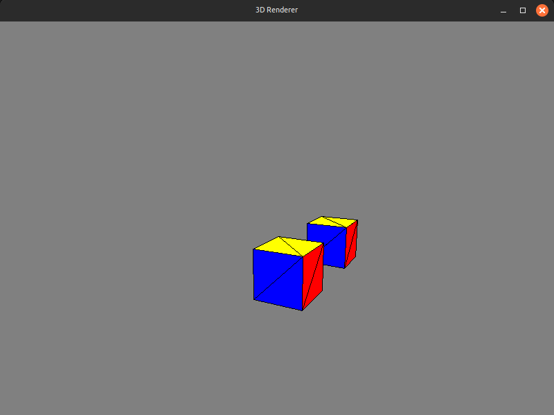

# 3d Renderer (java)
### Overview
This is a very simple 1-file 3d-rendering engine build with Java Swing for my CSIS 1400 Intro to Programming class. It demonstrates projection, camera movement and rotation, backface culling, and depth sorting without external libraries. 

### Features
* First-person camera (WASD to move, Q/E for down/up, arrow keys rotate)
* Renders cubes with filled triangles
* Backface culling and depth sorting
* Adjustable FOV and clipping planes

### How to Run
1. Clone the repository:
```
git clone https://github.com/zacharyisnthere/3d-renderer-java
```
(or download as ZIP and extract)

2. Compile and run:
```
cd path/to/3d-renderer-java/
```
```
mkdir -p out \
&& javac -d out -sourcepath src $(find src/renderer -name "*.java")
```
```
cd out
```
```
java renderer.Main
```

### Controls
* **WASD** - Move around
* **Q/E** - Move down/up
* **Arrow keys** - rotate left/right up/down

### Future Ideas
* Add more primitive shapes and meshes (sphere, pyramid, plane)
* Add custom texture support
* Add compatibility with common file types like .obj
* Add a lighting and shading system
* Z-buffer for depth, LOD system, other optimizations